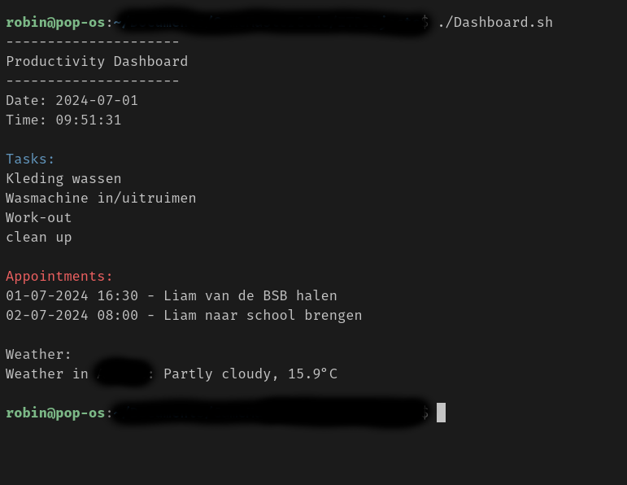

# Bash-Dashboard
A productivity Dashboard written in Bash to run in terminal

As one of my IT projects while I'm getting my degree for Expert IT Systems and Devices, I wanted to make my life easier.
This project gives me a good understanding how to automate my appointments and my To-Do's, also refered as tasks here.
As someone with ADD, I really need some grip in my life and while using a lot of reccomended apps and tools, it never really worked for me, either it makes me lazy or I need 3 different apps to get the same thing done that I can do here. I needed a program to give me the information as raw as possible without any bells and whistles, and no distracting notifications.

From here out I'm goint to future build this project to make my life easier and simpler. Maybe it can help you too!

